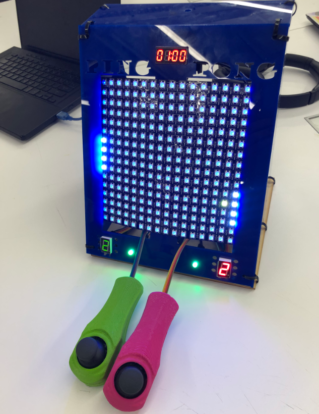
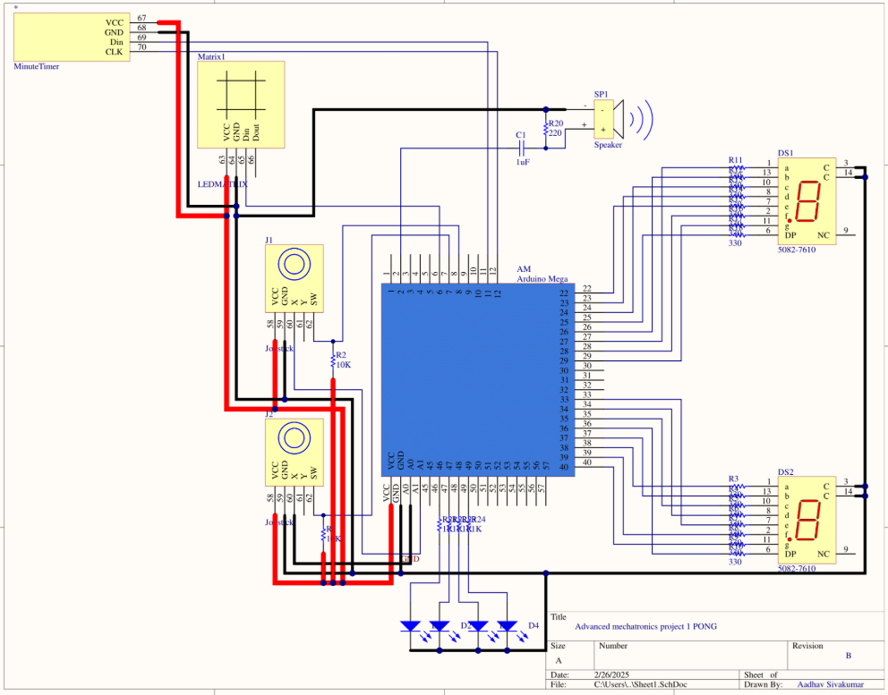

## DIY Ping Pong Machine
 Got an Arduino Mega, some LEDs, a LED matrix, A 7-Segment Display, a buzzer, and two joysticks? You can make your own Ping Pong machine!

# Acknowledgements...
 This project was created as a collaborative effort between Greta Perez-Haiek, Aadhav Sivakumar, Nathan Smurthwaite for the Advanced Mechatronics
 class (Spring 2025), as part of the Masters of Science in Mechatronics & Robotics at New York University. The project was met with overwhelming success, and with the encouragement of the Professor, we have decided to upload the Ping Pong Machine to Open Source so that others can enjoy.

**Collaborators...**
Greta Perez-Haiek || M.Sc in Mechatronics & Robotics, NYU Tandon School of Engineering
 - - (https://www.linkedin.com/in/greta-perez-haiek-7722bb211/)
 - - (Github: @Mythicane)

 Nathan Smurthwaite || M.Sc in Mechatronics & Robotics, NYU Tandon School of Engineering
 - - (https://www.linkedin.com/in/nathan-smurthwaite/)

 Aadhav Sivakumar || M.Sc in Mechatronics & Robotics, NYU Tandon School of Engineering
 - - (https://www.linkedin.com/in/aadhav-s/)
 - - (Github: @AadhavSivakumar)

# How do you play Ping Pong?
 This machine can be played as a 1 or two player game- each player will wield a joystick. Hold the joystick towards you, and then press down on the joystick to start the game. Both players must press down for the game to start. Move the joystick up and down to move your paddle up and down- moving the joystick left and right will do nothing. The ball will then bounce back and forth at a randomized interval- as more time goes by, the ball will speed up, and the changes in angles will get more aggresive! The goal of the game is to keep the ball from hitting your side- if it does, a point will be rewarded to your opponent. After each "loss," both players must press down on their joysticks to start another round in the game. After a minute, the game will end, and the winner will be the one with the most points! Reset your Arduino to begin anew. 

# How to get started...
 Please take a look at the "Ping Pong Machine Documentation.pdf" Report (Under Documentation), as it has all the background, as well as a detailed "how-to", for creating the machine.

 **Software Pre-Req**: Please make sure to download the Arduino IDE Software (https://www.arduino.cc/en/software) so that you may run the provided code.

 **Manufacturing Pre-Req**: Familiarization with either CNC, 3D printing, or Laser-cutting is recommended to be able to manufacture the Hull of the Machine and the joystick housings. The .STL files are provided for you. 

 **Electrical Pre-req**: Basic to intermediate knowledge of wiring is required. Please see the schematic below as a reference.

 **Parts Needed**: Arduino Mega (x1), 5mm LED Diodes (x4), 1-Bit 7-Segment Display (Score keeper) (x2), 4-Digit 7-Segment display (Clock Timer) (x1), two-prong Buzzer (x1), Dual-axis XY joystick modules (x2), 16 x 16 256 pixel LED Matrix (flexible, and full-color) (x1). 

 **Assembly Time (not including manufacturing time)**: Approx. 1-2 hours. 

# Bugs...
 We have thoroughly tested the code, and are confident that there are no flaws. However, if you do seem to find an issue, please let us know so that we can improve
the project. If there are any suggestions to include, also let us know! Thank you.
